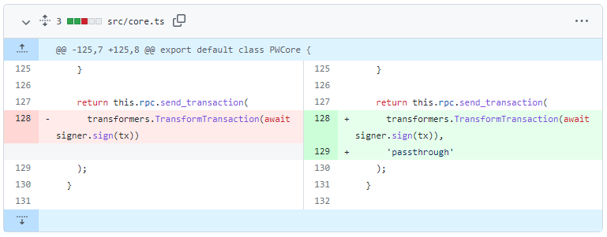

# Nervos CKB2021 Hard Fork Migration Guide

> Sign up [here](https://share.hsforms.com/16bQP75V4RMK_39KQiuFy1wcadup) to have important technical updates emailed to you directly in the future.

In Q2 2022, Nervos Network will undergo a hard fork to upgrade the network with new features. This hard fork is non-contentious, meaning there are no parties in opposition to the changes. A complete network upgrade is expected to occur on **May 10, 2022**.

In addition to the actual requirements for the hard fork, there are numerous updates to protocols and libraries being rolled out at the same time. This migration guide will cover the minimum steps that need to be taken to be fully compliant with all the changes being released.

The main areas requiring attention are:

1.  **Update Node Software:** If you are running a CKB node or CKB Indexer node, they must be updated to the newest version which is compliant with the new hard fork consensus rules. If you do not, your node will fall out of sync.
2.  **Update Libraries:** Your supporting libraries, such as PW-SDK, Lumos, and CKB-SDK-JS, must be updated to versions that properly support the hard fork. In some cases, you may be able to just update the library, and in other cases, you may need to update some code to work with the new libraries.
3.  **CKB2021 Address Support:** Your code should be updated to work with the new CKB2021 address scheme. This is a new address format that replaces all old address formats and is currently being rolled out to production dapps. Supporting this is usually as simple as updating the supporting libraries, but it will need to be tested. The old address formats are now officially deprecated, but these libraries will continue to support the old address formats to allow users to transition.
4.  **Omni Lock Support:** All accounts which utilize PW-Lock-based addresses should be migrated to the new Omni Lock. This new lock is audited and includes all the functionality from PW-Lock. Users will be able to continue using PW-Lock for the time being as PW-Lock addresses have not been formally deprecated yet. However, all projects are strongly encouraged to add support for Omni Lock addresses.
5.  **User Asset Migration:** After switching users from PW-Lock to Omni Lock, they will have a new address and their assets must be migrated.

## Potential Impact of Not Upgrading

If you chose not to upgrade, your dapp may be affected in the following ways:

-   Your CKB node may fall out of sync with the rest of the network. After this happens, it will fail to properly reflect balances and lose the ability to send transactions.
-   Your dapp will not be able to take advantage of some of the [new features](https://talk.nervos.org/t/ckb2021-hardfork-code-changes-overview/5999) which are activated after the launch of the CKB2021 hard fork upgrade.
-   Your dapp may not be able to recognize the new CKB2021 addresses. This means users will not be able to move funds properly between new dapps which do offer proper support of the new address format.
-   Your dapp will not use Omni Lock. Your users will continue to rely on PW-Lock, which is no longer being maintained. Your dapp will not be able to take advantage of the new features present in Omni Lock.

*****Your dapp may stop working if you choose to ignore this upgrade.*****

## 1\. Updating Your CKB Node and CKB Indexer Node

If you are hosting a CKB node, it must be updated to a minimum of **version v0.101.5** in order to operate normally after the mainnet hard fork date. The CKB Indexer node must also be updated to match, with a minimum of **version v0.3.2**.

If you are relying on externally hosted nodes by a third party, it is important to verify the host is aware of the change and has updated. You can check the version of a remote CKB node using the [local_node_info](https://github.com/nervosnetwork/ckb/blob/master/rpc/README.md#method-local_node_info) RPC method, which returns the version in the `$.result.version` key. You can check the version of a remote CKB Indexer node using the [get_indexer_info](https://github.com/nervosnetwork/ckb-indexer#get_indexer_info) RPC method, which also returns the version in the `$.result.version` key.

### 1a. Update the CKB Node

Your CKB node must be updated to a version that is compatible with the hard fork. The newest version can be viewed on the [releases](https://github.com/nervosnetwork/ckb/releases) page.

The basic process to update your node:

1.  Download and decompress the newest stable binaries from the [releases](https://github.com/nervosnetwork/ckb/releases) page.
2.  Shut down your node if it is running.
3.  Replace the old binaries with the new binaries.
4.  Start the node manually on the command line to complete the migration process, if necessary.
5.  Shut down and restart the node using your normal startup script.

A video demonstrating this process is available [here](https://drive.google.com/file/d/1rsvAi2Si51nyBlqQKrPH6hMbACDRGJcD/view?usp=sharing).

### 1b. Update the CKB Indexer Node

Your CKB Indexer node must be updated to a version compatible with the running CKB node. Updating to the newest available version from the [releases](https://github.com/nervosnetwork/ckb-indexer/releases) page is recommended.

The basic process to update a node is:

1.  Download and decompress the newest stable binaries from the [releases](https://github.com/nervosnetwork/ckb-indexer/releases) page.
2.  Shut down your node if it is running.
3.  Replace the old binaries with the new binaries.
4.  Start the node manually on the command line to complete the migration process, if necessary.
5.  Shut down and restart the node using your normal startup script.

A video demonstrating this process is available [here](https://drive.google.com/file/d/1s2PuszGF_QqZ2THe0ptD2HD2QEHnEbEv/view?usp=sharing).

### 1c. Update Your Code to Support the Changes in RPC v0.100.0+

If the CKB node you are updating is running a version below v0.100.0, then some code changes may be necessary to get it working with a newer node. Breaking changes were introduced to the RPC, which are listed on the [release page](https://github.com/nervosnetwork/ckb/releases/tag/v0.100.0).

*****If you rely on a third-party library then updating the library may be all that is needed.*****

Note: The change related to the `OutputValidator` below no longer applies in the most recent version of the CKB node. This is noted in the release notes for v0.100.0, but the change is no longer mandatory.

~~Starting with v0.100.0, the `send_transaction` RPC call defaults to using the `OutputValidator`, which only allows outputs to be created with specific "well-known" lock scripts that are defined in `ckb.toml`. This is intended as a security measure that can prevent theft of funds by restricting the destination lock script (addresses) which can be sent to by the node itself. All destinations must be specified in the `ckb.toml` configuration file or the transaction will be rejected.~~

~~For many developers, restoring the old functionality is desired since they may be sending funds to users' addresses, which cannot be defined in `ckb.toml`. To do this, simply add the value `'passthrough'` as the second parameter to the corresponding `send_transaction()` RPC function. An example of this can be seen in [PW-SDK's code](https://github.com/lay2dev/pw-core/commit/2c20ecc396326da011ce3749669a4cb729be6873).~~

## 2\. Update Your Supporting Libraries

New versions of the following libraries have been released in order to be fully compatible with the new CKB node, the CKB2021 address format, and support Omni Lock. If you rely on any of these libraries, it is recommended that you upgrade to the most recent version.

- [PW-SDK](https://github.com/lay2dev/pw-core/tree/dev)
- [Lumos](https://github.com/nervosnetwork/lumos/releases/)
- [CKB-SDK-JS](https://github.com/nervosnetwork/ckb-sdk-js/releases)
- [CKB-SDK-JAVA](https://github.com/nervosnetwork/ckb-sdk-java/releases)
- [CKB-SDK-GO](https://github.com/nervosnetwork/ckb-sdk-go/releases)
- [CKB-SDK-RUBY](https://github.com/nervosnetwork/ckb-sdk-ruby/releases/tag/v0.101.0)
- [CKIT](https://github.com/nervosnetwork/ckit)
- [CKB-JS-Toolkit](https://github.com/nervosnetwork/ckb-js-toolkit)

## 3\. Update Your Code to Support CKB2021 Addresses

The CKB2021 address format changes the way that addresses are encoded so they are more flexible and will require less maintenance by developers in the future. All old addresses (pre-2021), including both short addresses and long addresses, are now deprecated in favor of the new addresses (CKB2021). The old addresses will continue to work for the foreseeable future, but it is recommended that the new addresses are used going forward since they are required to properly utilize some of the features being released in the CKB2021 hard fork.

After updating to the CKB2021 address format you may notice that some addresses are now much longer than they were previously. This is expected because the short address format has now been officially deprecated in favor of full addresses.

### PW-SDK

If you are using PW-SDK, please use [this guide](./pw-sdk.md) to update your codebase to support CKB2021 addresses.

### Lumos

If you are using Lumos, please use [this guide](./lumos.md) to update your codebase to support CKB2021 addresses.

### Other Libraries

For all libraries other than PW-SDK and Lumos, please review the [Lumos guide](./lumos.md) since it will have the most similarity. Then view the official documentation for the library to get the required syntax.

## 4\. Update Your Code to Use Omni Lock Addresses

Omni Lock is a new lock script that supports all of the functionality of the original PW-Lock created by Lay2. However, Omni Lock is fully supported by the Nervos Foundation, and also incorporates powerful new features which are well beyond the scope of the original PW-Lock.

It is recommended that all users be migrated from PW-Lock to Omni Lock. Audits have been successfully been completed on Omni Lock, and PW-Lock is no longer being maintained. Your users will need to be guided through the migration process from the old PW-Lock address to a new Omni Lock address.

Omni Lock is a different lock, meaning that user addresses for PW-Lock and Omni Lock will be different. Assets will have to be migrated from PW-Lock to Omni Lock. PW-Lock has no official cut-off date, but it is recommended that assets begin migration immediately.

### PW-SDK

If you are using PW-SDK, please use [this guide](./pw-sdk.md) to update your codebase to support Omni Lock addresses.

### Lumos

If you are using Lumos, please use [this guide](./lumos.md) to update your codebase to support Omni Lock addresses.

### Other Libraries

For all libraries other than PW-SDK and Lumos, please review the [Lumos guide](./lumos.md) since it will have the most similarity. Then view the official documentation for the library to get the required syntax.

### Omni Lock Configuration for Testnet and Mainnet

Below are the deployed locations for Omni Lock addresses.

**Omni Lock Testnet Lock Script**\
Code Hash: 0x79f90bb5e892d80dd213439eeab551120eb417678824f282b4ffb5f21bad2e1e\
Hash Type: type

**Omni Lock Testnet Cell Dependency**\
Out Point: 0x9154df4f7336402114d04495175b37390ce86a4906d2d4001cf02c3e6d97f39c\
Index: 0x0

**Omni Lock Mainnet Lock Script**\
Code Hash: 0x9f3aeaf2fc439549cbc870c653374943af96a0658bd6b51be8d8983183e6f52f\
Hash Type: type

**Omni Lock Mainnet Cell Dependency**\
Out Point: 0xaa8ab7e97ed6a268be5d7e26d63d115fa77230e51ae437fc532988dd0c3ce10a\
Index: 0x1

## 5\. Migration of User Assets

After Omni Lock support has been added, users will need a way to migrate assets from their old PW-Lock address to their new Omni Lock address. The private keys of your users remain unchanges, but multiple different addresses are now controlled by those private keys.

It is recommended that developers provide instructions and tools to their users to help migrate assets. The [PW-UP Asset Migration Tool](https://pw-up.vercel.app/) is a demo dapp for migrating SUDT assets, and the source code is available on [GitHub](https://github.com/homura/pw-up).

## Examples, Tools, and Further Reading

### Examples

- [PW-SDK Examples](https://github.com/lay2dev/pw-core/tree/dev/examples)
- [Lumos Examples](https://github.com/nervosnetwork/lumos/tree/develop/examples)
- [Lumos Example MetaMask + Omni Lock](https://codesandbox.io/s/lumos-metamask-omni-example-forked-w3xov)
- [PW-UP Asset Migration Tool Example](https://github.com/homura/pw-up)

### Tools

- [Lumos Address Tool](https://nervosnetwork.github.io/lumos/tools/address-conversion)
- [CKB.tools Address Tool](https://ckb.tools/address)
- [PW-UP Asset Migration Tool](https://pw-up.vercel.app/)

### Further Reading

- [Omni Lock Asset Migration Guide](https://github.com/nervosnetwork/force-bridge/blob/main/docs/asset-migration-guide.md)
- [CKB Address Format](https://github.com/nervosnetwork/rfcs/blob/master/rfcs/0021-ckb-address-format/0021-ckb-address-format.md)
- [Omni Documentation on Cryptape Jungle](https://blog.cryptape.com/omnilock-a-universal-lock-that-powers-interoperability-1)
- [Omni Lock Specification](https://github.com/XuJiandong/docs-bank/blob/master/omni_lock.md)

## Where to Report Bugs and Request Assistance

If you experience problems with any of the tooling, please report your findings on the appropriate GitHub repository for the tool you are having a problem with.

If you need assistance with upgrading, please join the [Nervos Discord](https://discord.gg/nervos) and ask your question in the #dev-chat, #lumos, or #pw-core channels.

Sign up [here](https://share.hsforms.com/16bQP75V4RMK_39KQiuFy1wcadup) to have important technical updates emailed to you directly in the future.
